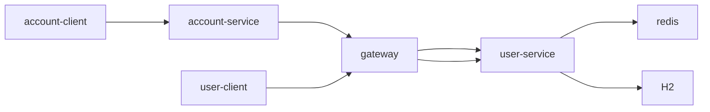

## Description

This demo ships 3 Java web-based applications to demonstrate a very simple distributed applications usage and how the Bithon monitors these applications.

Following chart shows the topo of these 3 applications.


- gateway
    
    A Spring Gateway based application which reverse proxy all requests to `user-service` application.

- user-service

    A backend Spring Boot web application based on tomcat webserver which provides some APIs for external applications.

- user-client

    A client application that calls the APIs provided by `user-service` via `gateway`.

- account-client

    A gRPC client application that periodically send request to gRPC server which is hosted by `account-service`.

- account-service

    A gRPC server application that calls API implemented by `user-service` to simulate a complicated server call. 

## Run this demo

This demo ships all services in a docker-compose, so you need a docker environment to build and run this demo.

### Build

```bash
sh docker/build-docker-images.sh
```

### Run

```bash
sh docker/start-docker-compose.sh
```

> NOTE: 
> 
> 1. If you find that there's an error saying `docker-compose: command not found` when executing above command, you need to follow the Docker [official site](https://docs.docker.com/compose/install/) to install docker-compose on your environment.
> 2. For running this demo on Mac M1, make sure this setting **Use Docker Compose V2** is enabled in the preference of Docker Desktop.

### Check the monitoring

After the docker-compose starts up, please visit [http://localhost:9897/web/home](http://localhost:9897/web/home) to view the monitoring.

