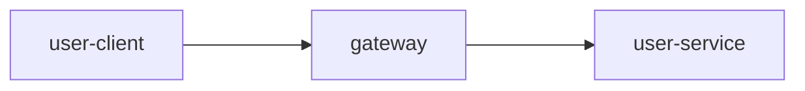

## Description

This demo ships 3 Java web-based applications to demonstrate a very simple distributed applications usage and how the Bithon monitors these applications.

Following chart shows the topo of these 3 applications.


- gateway
    
    A Spring Gateway based application which reverse proxy all requests to `user-service` application.

- user-service

    A backend Spring Boot web application based on tomcat webserver which provides some APIs for external applications.

- user-client

    A client application that calls the APIs provided by `user-service` via `gateway`.


## Run this demo

This demo ships all services in a docker-compose, so you need a docker environment to build and run this demo.

### Build

```bash
sh docker/build-docker-images.sh
```

### Run

```bash
cd docker && docker-compose pull bithon-server && docker-compose up
```
> NOTE: the `pull` option makes sure we're using the [latest image](https://hub.docker.com/r/bithon/server/tags) of [Bithon](https://github.com/FrankChen021/bithon).

### Check the monitoring

After the docker-compose starts up, please visit [http://localhost:9897/web/home](http://localhost:9897/web/home) to view the monitoring.

